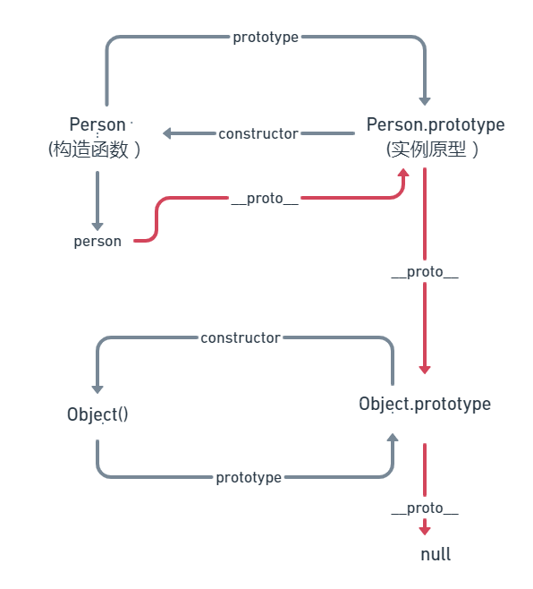

# 1.原型及原型链

> 本篇是在看完冴羽大佬的博客后，自己手动记一下以便加深理解，[原文地址](https://github.com/mqyqingfeng/Blog/issues/2)

## 构造函数创建对象

```js
function Person() {}
var person = new Person();
person.name = "will";
```

`Person`是一个构造函数,`new`创建一个实例化对象`person`;

## prototype

> **每一个函数都有一个`prototype`属性，`prototype`是函数才有的属性**

```js
function Person() {}
Person.prototype.name = "will";
var p1 = new Person();
var p2 = new Person();
console.log(p1.name); // will
console.log(p2.name); // will
```

- 函数的`prototype`属性指向了一个对象，这个对象正是调用构造函数而创建的实例的原型，也就是例子中` p1``p2 `的原型

## 原型定义

> 每一个`Javascript`对象（`null`除外）在创建的时候就会与之关联另一个对象，这个对象就是我们所说的原型，每一个对象都会从原型继承属性。

## —proto—

每一个`Javascript`对象（除`null`）都有一个`__proto__`属性,这个属性指向该对象的原型。

```js
function Person() {}
var person = new Person();
console.log(person.__proto__ === Person.prototype); // true
```

## constructor

- 每一个原型都有一个`constructor`属性指向关联的构造函数。

```js
function Person() {}
console.log(Person === Person.prototype.constructor); // true

// ES5方法获取原型 getPrototypeOf
console.log(Object.getPrototypeOf(person) === Person.prototype); // true
```

## 实例与原型

当读取实例的属性时，如果找不到，就会查找与对象关联的原型中的属性，如果还查不到，就去找原型的原型，一直找到最顶层为止。

## 原型的原型

原型也是一个对象，可以用最原始的方式创建它

```js
var obj = new Object();
obj.name = "will";
console.log(obj.name); // will
```

**其实原型对象就是通过`Object`构造函数生成的，实例的`__proto__`指向构造函数的`prototype`**

## 原型链

`Object.prototype`的原型？？

```js
console.log(Object.prototype.__proto__ === null); // true
```

`null`代表了什么？？？参考[阮一峰老师的 null 与 undefined 的区别](http://www.ruanyifeng.com/blog/2014/03/undefined-vs-null.html)

> `null`表示’没有对象‘，即此处不应该有值

所以`Object.prototype.__proto__`的值为`null`与`Object.prototype`没有原型，其实表达一个意思，属性查找到`Object.prototype`就可以停止查找了。

所以最终的关系图如下：

;

## 注意点

**constructor**

```js
function Person() {}
var person = new Person();
console.log(person.constructor === Person); // true
```

当获取`person.constructor`时，其实`person`并没有`constructor`属性，当不能读取到`constructor`属性时，会从`person`的原型也就是`Person.prototype`中读取，正好原型中有该属性，所以

```js
person.constructor === Person.prototype.constructor;
```

**--proto--**

`__ptoto__`绝大部分的浏览器都支持这个非标准的方法访问原型，然而它并不存在于`Person.prototype`中，实际上它来自于`Object.prototype`,与其说是一个属性，不如说是一个`getter/setter`,当使用`obj._proto_`时，可以理解放回了`Object.getPrototypeOf(obj)`.

**继承问题**

> 前面讲到`每一个对象都会从原型继承属性`，继承意味着复制操作，但`Javascript`默认并不会复制对象的属性，相反，`Javascript`只是在两个对象之间创建一个关联，这样，一个对象就可以通过委托访问另一个对象的属性和函数，所以与其叫继承，委托的说法反而更准确些。
