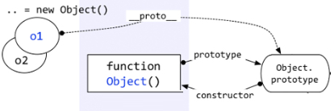

# 深入理解javascript原型和闭包系列

> [原作者地址-王福朋大佬](https://www.cnblogs.com/wangfupeng1988/p/4001284.html)

## 一切都是对象

**“一切都是对象”这句话的重点在于如何去理解“对象”这个概念**<br>
—当然，也不是所有的都是对象，值类型就不是对象。<br>

首先咱们还是先看看javascript中一个常用的运算符——typeof。typeof应该算是咱们的老朋友，还有谁没用过它？<br>

typeof函数输出的一共有几种类型，在此列出：

```js
function show(x) {

            console.log(typeof x);    // undefined
            console.log(typeof 10);   // number
            console.log(typeof 'abc'); // string
            console.log(typeof true);  // boolean

            console.log(typeof function () {});  //function

            console.log(typeof [1, 'a', true]);  //object
            console.log(typeof { a: 10, b: 20 });  //object
            console.log(typeof null);  //object
            console.log(typeof new Number(10));  //object
        }
show();
```
以上代码列出了`typeof`输出的集中类型标识，其中上面的四种（`undefined`, `number`, `string`, `boolean`）属于简单的**值类型**，不是对象。剩下的几种情况——函数、数组、对象、`null`、`new Number(10)`都是对象。他们都是**引用类型**。

判断一个变量是不是对象非常简单。值类型的类型判断用`typeof`，引用类型的类型判断用`instanceof`。
```js
var fn = function () { };
console.log(fn instanceof Object);  // true
```

**对象——若干属性的集合**
* java中对象都是new一个class出来的，而且里面有字段、属性、方法，规定的非常严格。但是js就比较随意-----数组是对象、函数是对象、对象还是对象。
* 对象里面的一切都是属性，只有属性，没有方法。
> 方法如何标识？<br>
> 方法也是一种属性，它的属性表示为**键值对**的形式，js对象可以任意的扩展属性，没有class的约束

最常见的例子：
```js{2}
var obj = {
    a: 10,
    b: function(x) {
        return this.a + x;
    },
    c: {
        name: 'xf',
        age: 29
    }
}
// 上面obj是自定义的对象,其中a/b/c就是它的属性，c的属性值也是一个对象
```

上面可能比较好理解，那么函数和数组也可以这样定义属性吗？--当然不行，但它可以用另外的形式，总之函数/数组之流，只要是对象，他就是属性的集合。<br>
以函数为例：
```js
var fn = function() {
    alert(100);
}
fn.a = 10;
fn.b = function() {
    alert(123);
}
fn.c = {
    name: 'xf',
    age: 29
}
```

以上代码，函数就作为对象被赋值了a/b/c三个属性，---很明显，这就是属性的集合。

:::tip
总结： js与Java相比，首先最需要解释的是弱类型，弱类型是最基本的用法，最常用<br>
**一切（引用类型）都是对象，对象是属性的集合**
:::

## 函数和对象的关系

函数就是对象的一种，因为通过instanceof函数可以判断
```js
var fn = function() {};
console.log(fn instanceof Object); // true
```
> * 函数是一种对象，但是函数却不像数组一样---你可以说数组是对象的一种，因为数组就像是对象的一个子集一样
> * 函数和对象之间，不仅仅是一种包含和被包含的关系，函数和对象之间的关系比较复杂，类似鸡生蛋蛋生鸡的逻辑

先看一个小例子
```js
function Fn() {
    this.name = 'wxf';
    this.age = 29;
}
var fn1 = new Fn();
```
上面的例子说明：对象可以通过函数来创建，对！只能说明这一点<br>
但 **对象都是通过函数创建的**--有些人会反驳，因为：
```js
var obj = {a: 10, b: 20};
var arr = [5, 'x', true]
```
但其实上面只是一种`快捷方式`, 又称为：**语法糖**。
本质如下：
```js
//var obj = { a: 10, b: 20 };
        //var arr = [5, 'x', true];

        var obj = new Object();
        obj.a = 10;
        obj.b = 20;

        var arr = new Array();
        arr[0] = 5;
        arr[1] = 'x';
        arr[2] = true;
```
**其中Object和Array都是函数**
```js
console.log(typeof(Object)) // function
console.log(typeof(Array)) // function
```

:::tip
* 所以很负责任的说：**对象都是通过函数来创建的**，而函数却又是一种对象！
:::

## prototype原型

前面我们了解到-一切都是对象，函数也是一种对象，他也是属性的集合，可以对函数进行自定义属性。不用等咱们去实验，JavaScript自己就先做了表率，人家就默认给函数一个属性--prototype.<br>

对，每个函数都有一个属性叫做`prototype`,这个`prototype`属性的值是一个对象（属性的集合，再次强调），**默认的只有一个叫做constructor的属性，指向这个函数本身**。


如上图，superType是一个函数，右侧的方框就是它的原型<br>
原型既然作为对象，属性的集合，不可能就只整个`constructor`来玩玩，肯定可以自定义的增加许多属性，例如`Object`这位大哥，人家的prototype里面，就好几个其他属性。


有一些方法似曾相识？？<br>
看下面，你也可以在自己自定义的方法prototype中新增自己的属性
```js
function Fn() {}
Fn.prototype.name = '王福朋';
Fn.prototype.getYear = function() {
    return 1988;
}
```
结果就变成下面：

这样做有何用呢？ --解决这个问题，咱们还是先说说jQuery吧，
```js
var $div = $('div');
$div.attr('myName', 'wfp');
```
以上代码中$('div')返回的是一个对象，对象--》被函数创建的。假设创建这一对象的函数是myjQuery。他其实是这样实现的。
```js
myjQuery.prototype.attr = function() {
    // ...
}
$('div') = new myjQuery();
```
不知道大家有没有看明白

如果用咱们自己的代码来演示，就是这样
```js
function Fn() { }
Fn.prototype.name = '王福朋';
Fn.prototype.getYear = function () {
    return 1988;
};

var fn = new Fn();
console.log(fn.name);
console.log(fn.getYear());
```

:::tip
Fn是一个函数，fn对象是从Fn函数new出来的，这样fn对象就可以调用Fn.prototype中的属性。<br>
**因为每一个对象都有一个隐藏的属性-`__proto__`,这个属性引用了创建这个对象的函数的prototype。即：fn.__proto__===Fn.prototype,这里的`__proto__`称为‘隐士原型’**
:::

## 隐士原型__ptoto__

> 之前已经提到，`每一个函数function都有一个prototype`,即：原型，这里再加一句-`每一个对象都有一个__proto__`,可称为隐士原型。<br>
> 这个__proto__是一个隐藏的属性，javaScript不希望开发者用到这个属性值，有些低版本的流浪器甚至不支持这个属性值.以你在Visual Studio 2012这样很高级很智能的编辑器中，都不会有__proto__的智能提示，但是你不用管它，直接写出来就是了。
```js
var obj = {};
console.log(obj.__proto__);
```
结果如下:

上面截图看来，obj.__proto__和Object.prototype的属性一样，这么巧！<br>
**答案就是一样**
obj这个对象本质上就是被Object函数创建的，因此`obj.__proto__ === Object.prototype`.可以用下面的图来表示。


即：`每一个对象都有一个__proto__属性，指向创建该对象的函数的prototype`


> 那么问题来了，上图中的`Object.prototype`也是一个对象，它的__proto__指向哪里？？？

在说明‘Object prototype’之前，先说一下自定义函数的prototype.自定义函数的prototype本质上就是和var obj = {}是一样的，都是被`Object`创建的，所以它的__proto__指向的就是Object.prototype,但是`Object.prototype确实是一个特例-》它的__proto__指向的是null,切记切记！`


> 问题来了，函数也是一种对象，函数也有__proto__吗？----》答案：当然有

函数也不是从石头缝蹦出来的，函数也是被创建出来的，谁创建了函数？ ---》 Function--注意大写的‘F’。<br>
代码如下：
```js
function fn(x, y) {
    return x + y;
}
console.log(fn(10 + 20));

var fn1 = new Function('x', 'y', 'return x + y');
console.log(fn1(5, 6));
```
以上代码，第一种方式是比较传统的函数创建方式，第二种是用 new Function创建。`不推荐用第二种方式`，这里只是向大家演示，函数是被Function创建的<br>

好了，根据上面说的一句话——对象的__proto__指向的是创建它的函数的prototype，就会出现：`Object.__proto__ === Function.prototype`。用一个图来表示。


* 上图中，很明显的标出了：自定义函数Foo.__proto__指向Function.prototype，Object.__proto__指向Function.prototype，唉，怎么还有一个……Function.__proto__指向Function.prototype？这不成了循环引用了？

对！是一个环形结构。

* 其实稍微想一下就明白了。Function也是一个函数，函数是一种对象，也有__proto__属性。既然是函数，那么它一定是被Function创建。所以——Function是被自身创建的。所以它的__proto__指向了自身的Prototype。

> 问题来了，Function.prototype指向的对象，它的__proto__是不是也指向Object.prototype ？<br>
> 答案是肯定的，因为Function.prototype 指向的对象也是一个普通的被Object创建的对象，所以遵循基本原则


## instanceof

对于值类型，你可以通过`typeof`判断，string/number/boolean都很清楚，但是typeof在判断到引用类型时，返回值只有object/function,你不知道它到底是object对象，还是数组，还是new Number等等<br>
这个时候就需要用到`instanceof`，例如：
```js
function Foo() {}
var f1 = new Foo();

console.log(f1 instanceof Foo); // true
console.log(f1 instanceof Object); // true
```
> 问题来了：上面f1是Foo创建的，但是 `f1 instanceof Object`为什么是 `true`?
* 至于为什么过会再说，先看一下instanceof的判断规则，如下图：


* instanceof运算符的第一个变量是一个对象，暂时称为A；第二个变量一般是一个函数，暂时称为B.
* instanceof的判断规则是：`沿着A的__proto__这条线来找，同时沿着B的prototype这条线来找，如果两条线能找到同一个引用，那么就返回true.如果找到终点还未重合，则返回false`.

按照以上规则，大家看看‘f1 instanceof Object’这句代码是不是true? 根据上图很容易看出来，就是true

**通过以上规则，就可以解释很多比较怪异的现象，例如：**
```js
console.log(Object instanceof Function) // true
console.log(Function instanceof Object) // true
console.log(Function instanceof Function) // true
```
看似很乱，但是可以整体看一下，如下图


* 看看这个图片，你也就知道为何上面三个看似混乱的语句返回的是true了

> 问题来了： Instanceof这样设计，到底有什么用？到底instanceof想表达什么？<br>
> 重点就这样被这位老朋友给引出来了-》`继承`-》`原型链`

:::tip
instanceof表示的就是一种继承关系，或者是原型链结构
:::

## 继承（原型链）

`js中的继承是通过原型链来体现的，看下面代码`

```js
function Foo() {}
var f1 = new Foo();
f1.a = 10;

Foo.prototype.a = 100;
Foo.prototype.b = 200;

console.log(f1.a) // 10
console.log(f1.b) // 200
```

> 问题来了：以上代码，f1是Foo函数new出来的对象，f1.a是f1对象的基本属性，f1.b是怎么来的？？？<br>
> 从Foo.prototype得来的，因为f1.__proto__指向的是Foo.prototype

:::tip
**访问一个对象属性时，先在基本属性中查找，如果没有，再沿着__proto__这条链向上找，这就是原型链**
:::
看图说话


上图中，访问f1.b时，f1的基本属性中没有b，于是沿着__proto__找到了Foo.prototype.b。

> 问题来了：那么我们在实际应用中如何区分一个属性是基本的还是从原型中找到的呢？<br>
> 大家可能都知道答案了-》hasOwnProperty,特别是在 for...in....循环中，一定要注意


> 问题来了：等等，不对。f1的这个hasOwnProperty方法是从哪里来的？ f1本身没有，Foo.prototype中也没有，哪儿来的？<br>
> 他是从Object.prototype中来的，如下图


**对象的原型链是沿着__proto__这条线走的，因此在查找f1.hasOwnProperty属性时，就会顺着原型链一直查找到Object.prototype。**
* 由于所有对象的原型链都会找到Object.prototype,因此所有对象都会有Object.prototype的方法，这就是所谓的`继承`。
* 当然这只是一个例子，你可以自定义函数和对象来实现自己的继承。

说一个函数的例子：<br>
我们都知道每一个函数都有`call`、`apply`方法，都有`arguments`、`length`、`caller`等属性。为什么每个函数都有?<br>
这肯定是`继承`,函数是由Function创建的，因此继承Function.prototype中的方法。在的Visual Studio中验证一下；如下图：


* 看到了吧，有call、length等这些属性
* 那怎么还有hasOwnProperty呢？——那是Function.prototype继承自Object.prototype的方法。有疑问可以看看上一节将instanceof时候那个大图，看看Function.prototype.__proto__是否指向Object.prototype。

## 原型的灵活性

首先，对象属性可以随时改动。

对象或者函数，刚开始new出来之后，可能啥属性都没有。但是你可以这会儿加一个，过一会儿在加两个，非常灵活。

在jQuery的源码中，对象被创建时什么属性都没有，都是代码一步一步执行时，一个一个加上的。


其次，如果继承的方法不合适，可以做出修改。

```js
var obj = {a: 10, b: 20};
console.log(obj.toString()); // [object. object]

var arr = [1, 2, true];
console.log(arr.toString()); // 1, 2, true
```
Object和Array的toString()方法不一样。肯定是Array.prototype.toString()方法做了修改。

同理，我也可以自定义一个函数，并自己去修改prototype.toString()方法。
```js
function Fn() {}
var f1 = new Fn();

Fn.prototype.toString = function() {
    return 'xf';
}

console.log(f1.toString()); // xf
```
最后，如果感觉当前缺少你要用的方法，可以自己去创建

例如在json2.js源码中，为Date、String、Number、Boolean方法添加一个toJSON的属性。


:::tip
如果你要添加内置方法的原型属性，最好做一步判断，如果该属性不存在，则添加。如果本来就存在，就没必要再添加了。
:::