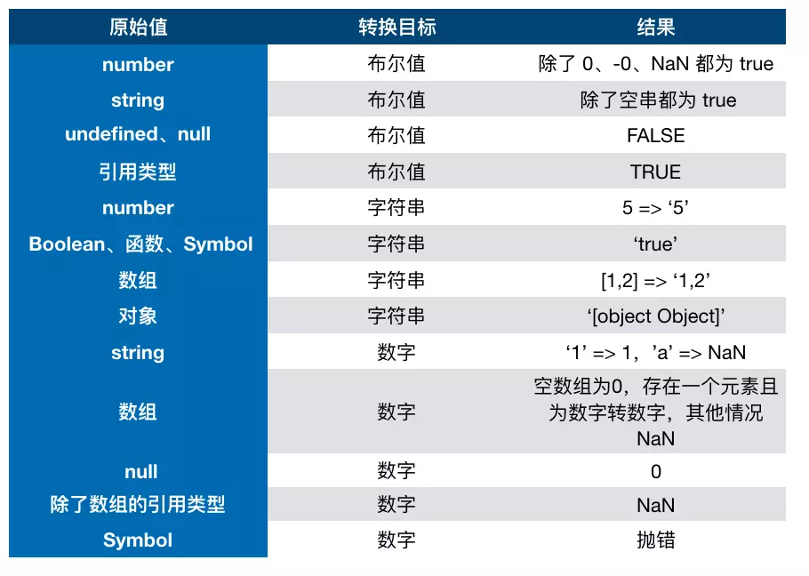

# js

<!-- ## 基础部分 -->

### 原始类型

::: tip
js 中有六种原始类型，原始类型保存值, 引用类型保存对象的指针。
:::

### 六种原始类型

- string
- number
- boolean
- null
- undefined
- symbol

### null 到底是什么类型

书中解释`null`属于空对象, 是一个对象类型。在早期的`js`版本中使用的是 32 位系统，考虑性能问题，使用低位存储变量的类型信息，`000`开头代表对象，而`null`代表全零，所以将它错误的判断成`object`，虽然后期内部代码已经改变，但`null`类型为`object`的判断却保留了下来，属于历史遗留问题，是`bug`也好，说它是空对象，是对象类型也能理解的通。

### 对象类型

::: tip
js 中除了原始类型，其他的都属于对象类型，对象类型存储的是地址，而原始类型存储的是值。
:::

```js
var a = [];
var b = a;
a.push(2);
console.log(b); // 输出[2]
```

以上代码创建了一个对象类型`a`(数组)，再把`a`的地址赋值给了变量`b`，`b`的值也同步发生了改变，因为他们在内存中使用的是同一个地址，改变其中任何一个变量的值，都会影响到其他的变量。

#### 对象当做函数参数

```js
function person(per) {
  per.age = 10;
  per = {
    name: "李四",
    age: 18,
  };
  // {} 等于 new Object()，创建了一个新的对象，是新的地址了
  return per;
}
var p1 = {
  name: "张三",
  age: 20,
};
var p2 = person(p1);
console.log(p1.age); // 输出 10
console.log(p2.age); // 输出 18
```

**代码分析**

1. `person`函数中，`per`传递的是对象`p1`的指针副本
2. 在函数内部，改变了`per`的属性，会同步反映到对象`p1`上，`p1`对象中的`age`属性发生了改变，即值为 10
3. `person`函数又返回了一个新的对象，这个对象和参数`per`没有任何关系，因为它分配了一个新的内存地址
4. 如下图所示


### typeof 和 instanceof

#### typeof

::: tip
`typeof`能准确判断`null`以外的原始类型的值，对于对象类型，除了函数会判断成`function`,其他对象一律返回`object`
:::

```js
typeof 1; // number
typeof "1"; // string
typeof true; // boolean
typeof undefined; // undefined
typeof Symbol(); // symbol

typeof []; // object
typeof {}; // object
typeof console.log; // function
```

#### instanceof

::: tip
`instanceof`通过原型链可以判断出对象的类型，但并不百分百准确
:::

```js
function Person(name) {
  this.name = name;
}
var p1 = new Preson();
console.log(p1 instanceof Person); // true

var str = new String("str");
console.log(str instanceof String); // true
```

### 类型转换

`js`中类型转换只有三种：

1. 转换成数字
2. 转换成布尔值
3. 转换成字符串

#### 经典类型面试题

```js
console.log([] == ![]); // true
```

**代码分析**

1. 左侧是一个对象（数组）
2. 右侧是一个布尔值，对象`[]`转换成布尔值是`true`，因为除了`null`所有对象都可以转换成布尔值，所以`![]`结果为`false`
3. 此时相当于`对象==布尔值`，依据类型转换规则，转换成数字类型进行比较
4. 对象（空数组）转换成`0`, 布尔值`false`转换成`0`
5. 即`0==0`, 返回`true`

类型转换规则，如下图


### == 和 ===

#### ===严格相等

::: tip
`===`叫做严格相等，指左右两边不仅值要相等，类型也要相等， 例如`'1'===1`结果是`false`, 左边是`string`,右边是`number`.
:::

```js
console.log("1" === 1); // 输出false
```

#### ==不严格相等

::: tip
`==`没有`===`那样严格，对于一般情况，只要值相等，就返回`true`，但`==`还涉及一些类型转换，规则如下：

- 两边的类型是否相同，相同的话就比较值的大小， 例如`1==2`,返回`false`
- 类型不同会进行类型转换
- 判断类型是否是`null`和`undefined`,是的话就返回`true`
- 判断类型是否是`string`和`nunber`,是的话，把`string`类型转换成`number`，在进行比较
- 判断其中一方是否是`boolean`, 是的话，就把`boolean`装换成`number`,在进行比较
- 如果其中一方是`object`,且另一方是`string`、`number`或`symbol`,会将`object`转化成原始类型后，在进行比较
  :::

```js
1 == {id:1, name: 'a'}
        ↓
1 == '[object object]'
```

#### 转 boolean

除了`undefined`、`null`、`false`、`0`、`-0`、`NAN`和空字符串转换成`false`以外，其他所有值都转换成`true`,包括所有对象。

#### 对象转原始类型

对象转原始类型，会调用内置的[ToPrimitive]函数，对于该函数而言，其逻辑如下：

1. 是否已经是原始类型，是则直接返回
2. 调用`valueOf()`，如果转换为原始类型，则返回
3. 调用`toString()`，如果转换为原始类型，则返回
4. 也可以重写`Symbol.toPrimitive()`方法，优先级别最高
5. 如果都没有返回原始类型，会报错

```js
var obj = {
  value: 0,
  valueOf() {
    return 1;
  },
  toString() {
    return "2";
  },
  [Symbol.toPrimitive]() {
    return 3;
  },
};
console.log(obj + 1); // 输出4
```

#### 对象转原始类型应用

```js
// 问：如何使if(a==1&&a==2&&a==3) {console.log('true')};正确打印'true'
var a = {
  value: 0,
  valueOf() {
    this.value++;
    return this.value;
  },
};
if (a == 1 && a == 2 && a == 3) {
  console.log("true"); // 输出true
}
```

**代码分析**：

1. 重写对象`a`的`valueOf()`方法，使`value`属性每次调用时自增
2. 当判断`a==1`时，第一次调用`valueOf()`方法，此时`value`等于 1，判断`1==1`，继续向下走
3. 判断`a==2`时，第二次调用`valueOf()`方法，此时`value`等于 2，判断`2==2`，继续向下走
4. 判断`a==3`时，第三次调用`valueOf()`方法，此时`value`等于 3，判断`3==3`，`if`判断结束
5. `if`条件判断为`true && true && true`，执行`console.log('true')`，打印`true`

### new 构造调用的过程

无论是通过字面量还是通过`new`进行构造函数调用创建出来的对象，其实都一样。调用`new`的过程如下：

1. 创建一个新对象
2. 原型绑定
3. 绑定 this 到这个新对象上
4. 返回新对象

### this 全解析

`JavaScript`中的`this`只有如下几种情况，并按他们的优先级从低到高划分如下：

1. 独立函数调用，例如`getUserInfo()`，此时`this`指向全局对象`window`
2. 对象调用，例如`stu.getStudentName()`，此时`this`指向调用的对象`stu`
3. `call()`、`apply()`和`bind()`改变上下文的方法，`this`指向取决于这些方法的第一个参数，当第一个参数为`null`时，`this`指向全局对象`window`
4. 箭头函数没有`this`，箭头函数里面的`this`只取决于包裹箭头函数的第一个普通函数的`this`
5. `new`构造函数调用，`this`永远指向构造函数返回的实例上，优先级最高。

```js
var name = "global name";
var foo = function() {
  console.log(this.name);
};
var Person = function(name) {
  this.name = name;
};
Person.prototype.getName = function() {
  console.log(this.name);
};
var obj = {
  name: "obj name",
  foo: foo,
};
var obj1 = {
  name: "obj1 name",
};

// 独立函数调用，输出：global name
foo();
// 对象调用，输出：obj name
obj.foo();
// apply()，输出：obj1 name
obj.foo.apply(obj1);
// new 构造函数调用，输出：p1 name
var p1 = new Person("p1 name");
p1.getName();
```

#### this 解析流程图


### 闭包

::: tip
闭包的定义其实很简单：函数 A 内部有一个函数 B，函数 B 可以访问到函数 A 中的变量，那么函数 B 就是闭包
:::

```JS
function A() {
  let a = 1
  window.B = function () {
      console.log(a)
  }
}
A()
B() // 1
```

#### 闭包的几种表现形式

::: tip

1. 返回一个函数
2. 作为函数参数传递
3. 回调函数
4. 非典型闭包 IIFE(立即执行函数表达式)
   :::

**返回一个函数**：这种形式的闭包在`JavaScript`的代码编写中，是非常常见的一种方式。

```js
var a = 1;
function foo() {
  var a = 2;
  // 这就是闭包
  return function() {
    console.log(a);
  };
}
var bar = foo();
// 输出2，而不是1
bar();
```

**作为函数参数传递**：无论通过何种手段将内部函数传递到它所在词法作用域之外，它都会持有对原始作用域的引用，无论在何处执行这个函数，都会产生闭包。

```js
var a = 1;
function foo() {
  var a = 2;
  function baz() {
    console.log(a);
  }
  bar(baz);
}
function bar(fn) {
  // 这就是闭包
  fn();
}
// 输出2，而不是1
foo();
```

**回调函数**：在定时器、事件监听、Ajax 请求、跨窗口通信、Web Workers 或者任何异步中，只要使用了回调函数，实际上就是在使用闭包。

```js
// 定时器
setTimeout(function timeHandler(){
  console.log('timer');
}，100)

// 事件监听
$('#container').click(function(){
  console.log('DOM Listener');
})
```

**IIFE**：IIFE(立即执行函数表达式)并不是一个典型的闭包，但它确实创建了一个闭包。

```js
var a = 2;
(function IIFE() {
  // 输出2
  console.log(a);
})();
```

#### 经典循环和闭包面试题

::: tip
以下代码运行结果是什么，如何改进？
:::

```js
for (var i = 1; i <= 5; i++) {
  setTimeout(function timer() {
    console.log(i);
  }, i * 1000);
}
```

**代码分析**：<br>

1. `for`循环创建了 5 个定时器，并且定时器是在循环结束后才开始执行
2. `for`循环结束后，用`var i`定义的变量`i`此时等于 6
3. 依次执行五个定时器，都打印变量`i`，所以结果是打印 5 次 6

**第一种改进方法**：利用`IIFE(立即执行函数表达式)`当每次`for`循环时，把此时的`i`变量传递到定时器中

```js
for (var i = 1; i <= 5; i++) {
  (function(j) {
    setTimeout(function timer() {
      console.log(j);
    }, i * 1000);
  })(i);
}
```

**第二种方法**：`setTimeout`函数的第三个参数，可以作为定时器执行时的变量进行使用

```js
for (var i = 1; i <= 5; i++) {
  setTimeout(
    function timer(j) {
      console.log(j);
    },
    i * 1000,
    i
  );
}
```

**第三种方法(推荐)**：在循环中使用`let i`代替`var i`

```js
for (let i = 1; i <= 5; i++) {
  setTimeout(function timer() {
    console.log(i);
  }, i * 1000);
}
```

### 浅拷贝、深拷贝

由于`JavaScript`中对象是引用类型，保存的是地址，深、浅拷贝的区别是，当拷贝结束后，在一定程度上改变原对象中的某一个引用类型属性的值，新拷贝出来的对象依然受影响的话，就是浅拷贝，反之就是深拷贝。

#### 浅拷贝的几种实现方法

::: tip

1. 利用`Object.assign()`方法
2. 利用`...`扩展运算符
   :::

**第一种方法：**`Object.assign()`会拷贝原始对象中所有的属性到一个新对象上，如果属性为对象。则拷贝的是对象的地址，改变对象中的属性值，新拷贝出来的对象依然会收到影响。

```js{12,13,14}
var obj = {
  name: "张三",
  age: 23,
  isStudent: false,
  job: {
    name: "FE",
    money: 12,
  },
};
var newObj = Object.assign({}, obj);
obj.job.money = 21;
console.log(newObj.name); // 输出 张三
console.log(newObj.age); // 输出 23
console.log(newObj.job.money); // 输出 21， 受影响
```

**第二种方法：**`...`扩展运算符是`ES6`新增的内容

```js
var obj = {
  name: "张三",
  age: 23,
  isStudent: false,
};
var newObj = { ...obj };
console.log(newObj.name); // 张三
console.log(newObj.age); // 23
```

#### 深拷贝几种实现方式

:::tip

1. 配合使用`JSON.parse()`和`JSON.stringify()`两个函数（局限性比较大）
2. 实现自己的简易深拷贝方法
3. `lodash`第三方库实现深拷贝
   :::

**第一种方法：** 利用`JSON`的序列化和反序列化方法，可实现简易对象的深拷贝，但此方法有较大的限制：<br>

1. 会忽略属性值为`undefined`的属性
2. 会忽略属性值为`Symbol`的属性
3. 不会序列化函数
4. 不能解决循环引用的问题，直接报错

```js
var obj = {
  name: "张三",
  age: 23,
  address: undefined,
  sayHello: function() {
    console.log("hello");
  },
  isStudent: false,
  job: {
    name: "FE",
    money: 12,
  },
};
var newObj = JSON.parse(JSON.stringify(obj));
obj.job.money = 21;
console.log(newObj.name); // 输出 张三
console.log(newObj.age); // 输出 23
console.log(newObj.job.money); // 输出 12

console.log(newObj.address); // 报错
console.log(newObj.sayHello()); // 报错
```

**第二种方法：** 实现自己的深拷贝函数

```js
function deepClone(obj) {
  function isObject(o) {
    return (typeof o === "object" || typeof o === "function") && o !== null;
  }
  if (!isObject(obj)) {
    throw new Error("非对象");
  }
  var isArray = Array.isArray(obj);
  var newObj = isArray ? [...obj] : { ...obj };
  Reflect.ownKeys(newObj).forEach((key) => {
    newObj[key] = isObject(newObj[key]) ? deepClone(newObj[key]) : newObj[key];
  });
  return newObj;
}
var obj = {
  name: "aa",
  age: 23,
  job: {
    name: "xf",
    money: 1000,
  },
};
var cloneObj = deepClone(obj);
obj.job.money = 20000;
console.log(obj.job.money); // 输出 20000
console.log(cloneObj.job.money); // 输出 1000
```

**第三种方法：** 使用[lodash](https://lodash.com/docs#cloneDeep)第三方函数库实现（需要先引入 lodash.js）

```js{10}
var obj = {
  name: "李四",
  age: 20,
  isStudent: false,
  job: {
    name: "xf",
    money: 12000,
  },
};
var newObj = _.cloneDeep(obj);
obj.job.money = 2000;
console.log(newObj.name); // 输出 李四
console.log(newObj.job.money); // 输出 12000 不受影响
```

### 继承

在`JavaScript`ES6 之前，实现继承需要依赖原型、原型链和构造函数等等技术手段组合使用，在 ES6 之后，可以使用`Class`类继承(并没有真正的类，只是一个语法糖，实质依然是函数)
::: tip 继承的几种方式

1. 原型链实现继承
2. 借用构造函数实现继承
3. 组合继承
4. 寄生组合继承
5. 类继承
   :::

#### 原型链实现继承

::: tip
通过重写子类的原型，并将它指向父类的手段实现。这种方式实现的继承，创建出来的实例既是子类的实例，又是父类的实例。它有如下几种缺陷：

1. 不能向父类构造函数传参
2. 父类上的引用类型属性会被所有实例共享，其中一个实例改变时，会影响其他实例
   :::

```js
function Animal() {
  this.colors = ["red", "blue"];
}
function Dog(name) {
  this.name = name;
}
Dog.prototype = new Animal();

var dog1 = new Dog("旺财");
var dog2 = new Dog("钢镚");
dog2.colors.push("yellow");
console.log(dog1.colors); // ["red", "blue", "yellow"]
console.log(dog2.colors); // ["red", "blue", "yellow"]

console.log(dog1 instanceof Dog); // true
console.log(dog1 instanceof Animal); // true
```

#### 借用构造函数实现继承

:::tip
借用构造函数实现继承，通过在子类中使用`call()`方法，实现借用父类构造函数并向父类构造函数传参的目的。但这种方法，无法继承父类原型对象上的属性和方法。
:::

```js
function Animal(name) {
  this.name = name;
  this.colors = ["red", "blue"];
}
Animal.prototype.eat = function() {
  console.log(this.name + " is eating!");
};
function Dog(name) {
  Animal.call(this, name);
}

var dog1 = new Dog("旺财");
var dog2 = new Dog("钢镚");
dog2.colors.push("yellow");

console.log(dog1.colors); // ["red", "blue"]
console.log(dog2.colors); // ["red", "blue", "yellow"]

console.log(dog1 instanceof Dog); // true
console.log(dog2 instanceof Animal); // false

console.log(dog1.eat()); // 报错
```

#### 组合继承

::: tip
组合继承是组合了原型链继承和借用构造函数继承这两种方法，它保留了两种继承方式的优点，但它并不是百分百完美的：父类构造函数被调用多次。
:::

```js
function Animal(name) {
  this.name = name;
  this.colors = ["red", "blue"];
}
Animal.prototype.eat = function() {
  console.log(this.name + " is eatting");
};
function Dog(name) {
  Animal.call(this, name);
}
Dog.prototype = new Animal(); // 第一次调用
var dog1 = new Dog("dog1"); // 第二次调用
var dog2 = new Dog("dog2"); // 第三次调用
dog1.colors.push("yellow");
console.log(dog1.name); // 输出dog1
console.log(dog2.colors); // 输出['red','blue']
console.log(dog2.eat()); // 输出dog2 is eatting
```

#### 寄生组合继承

::: tip
寄生组合继承是在组合继承的基础上，采用`Object.create()`方法来改造实现
:::

```js
function Animal(name) {
  this.name = name;
  this.colors = ["red", "blue"];
}
Animal.prototype.eat = function() {
  console.log(this.name + " is eatting");
};
function Dog(name) {
  Animal.call(this, name);
}
Dog.prototype = Object.create(Animal.prototype);
Dog.prototype.constructor = Dog;
var dog1 = new Dog("dog1");
var dog2 = new Dog("dog2");
dog1.colors.push("yellow");
console.log(dog1.name); // 输出dog1
console.log(dog2.colors); // 输出['red','blue']
console.log(dog2.eat()); // 输出dog2 is eatting
```

#### Class 实现继承

::: tip
运用 ES6 class 新特性来实现继承
:::

```js
class Animal {
  constructor(name) {
    this.name = name;
    this.colors = ["red", "blue"];
  }
  eat() {
    console.log(this.name + " is eatting");
  }
}
class Dog extends Animal {
  constructor(name) {
    super(name);
  }
}
var dog1 = new Dog("dog1");
var dog2 = new Dog("dog2");
dog1.colors.push("yellow");
console.log(dog1.name); // 输出dog1
console.log(dog2.colors); // 输出['red','blue']
console.log(dog2.eat()); // 输出dog2 is eatting
```

### ES6

本章节只介绍 ES6 常考知识点，更多基础知识请直接跳转至[你不知道的 JavaScript(中)](/books/javascript/know-down.md)<br>
学习更多 ES6 知识，请移步阮一峰老师书籍[ECMAScript6 入门](https://es6.ruanyifeng.com/)

#### var、let 和 const 的区别

::: tip

1. `var`声明的变量会提升到作用域的顶部，而`let`和`const`不会进行提升
2. `var`声明的全局变量会被挂载到全局`window`对象上，而`let`和`const`不会
3. `var`可以重复声明同一个变量，而`let`和`const`不会
4. `var`声明的变量作用域范围是函数作用域，而`let`和`const`声明的变量作用域范围是块级作用域。
5. `const`声明的常量，一旦声明则不能再次赋值，再次赋值会报错(更改对象属性不会，因为对象地址没有变)
   :::

**作用域提升：**

```js
console.log(a); // 输出undefined
console.log(b); // 报错
console.log(PI); // 报错
var a = "abc";
let b = "ABC";
const PI = 3.1415;
```

**挂载到全局变量：**

```js
var a = "abc";
let b = "ABC";
const PI = 3.1415;

console.log(window.a); // 输出abc
console.log(window.b); // 输出undefined
console.log(window.PI); // 输出undefined
```

**重复声明变量：**

```js
var a = "abc";
var a;
console.log(a); // 输出abc

let b = "ABC";
let b; // 报错
```

**变量的作用域范围：**

```js
function foo() {
  var flag = true;
  if (flag) {
    var a = "abc";
    let b = "ABC";
    console.log(a); // 输出abc
    console.log(b); // 输出ABC
  }
  console.log(a); // 输出abc
  console.log(b); // 报错
}
foo();
```

**const 常量：**

```js
const PI = 3.1415;
PI = 3.1415926; // 报错
```

#### 扩展/收缩符

::: tip
ES6 新增加的运算符`...`，称为扩展或者收缩，具体作用取决于到底如何使用。
:::

```js
// ...的扩展
function foo(x, y, z) {
  console.log(x, y, z); // 输出1,2,3
}
var arr = [1, 2, 3];
foo(...arr); // 扩展数组：ES6写法
foo.apply(null, arr); // 扩展数组：ES5写法

// ...的收缩
// 1.收集参数：ES6写法
function bar(...arr) {
  console.log(arr); // 输出[1,2,3,4,5]
}
// 2.收集参数：ES5写法
function foo() {
  var args = Array.prototype.slice.call(arguments);
  console.log(args); // 输出[1,2,3,4,5]
}
bar(1, 2, 3, 4, 5);
foo(1, 2, 3, 4, 5);
```
